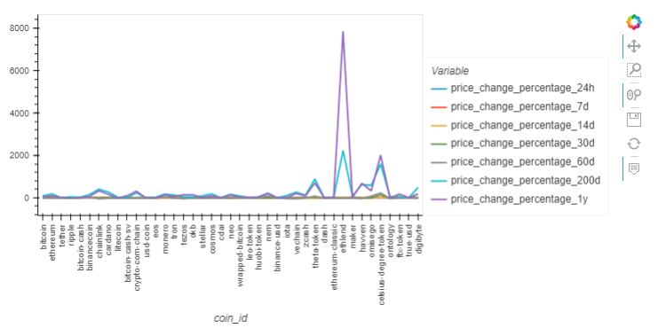
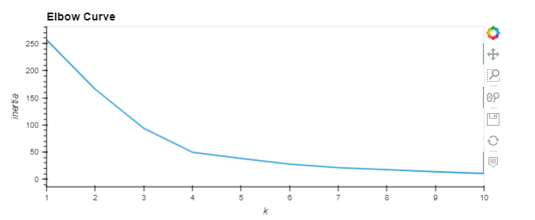
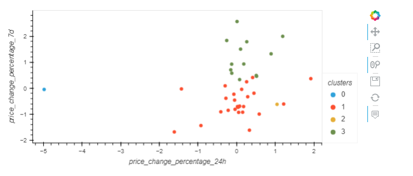
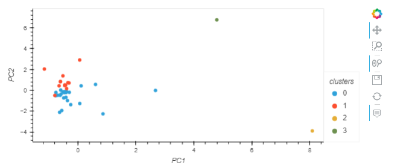

# CriptoClustering

In this project unsupervised learning is used to predict if cryptocurrencies are affected by price changes in different time periods.

K-Means clustering is used to group cryptocurrencies by their performance. 
Elbow method is used to calculate the the optimal number of clusters.

 K-Means algorithm, with the optimal number of clusters, is applied on the original dataset to predict the clusters.

 

Then Principal Component Analysis (PCA) is applied to optimize the clusters. Features are reducd to three principal components. The total explained variance of the three principal components are 89%, which means 89% information is attributed to each principal component.

Again, K_Means method is applied on the new dataset (made of PC-s). The optimal number of clusters is detrmined by Elbow method.

New clusters are predicted for the reduced features dataset.

  

## References
This project is a part of UC Berkeley "Data Analysis and Visualisation" Boot Camp education services.

 
